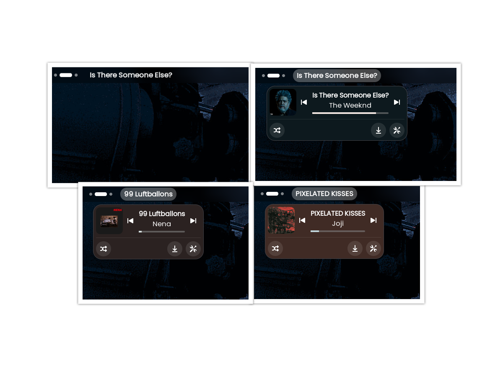

# 🎵 GSpotify - GNOME Shell Extension

GSpotify is a GNOME Shell extension that integrates with the Spotify MPRIS interface to display current track information, album art, and playback controls directly in your top panel.

It is designed to be theme-aware, and customizable\*

---

## ✨ Features

- **Now Playing info**: Show track title in the top bar.
- **Album Art**: Displays album art in the dropdown menu.
- **Playback Controls**: Play, pause, skip, and previous buttons.
- **Progress Bar**: Live track progress indicator with dynamic accent color.
- **Theme-Aware Colors**: Colors adapt based on the dominant album art color.

---

## 📸 Media



---

## 🚧 Todo

- [x] Shuffle and repeat buttons if available.
- [ ] Add support for track downloading.
- [ ] Synced and Plain Lyrics.
- [ ] Remove unnecessary logging.

---

## 📦 Installation

### From Extensions Website

This extension is available on [GNOME Extensions Website](https://extensions.gnome.org/extension/8659/gspotify/).

### From Source

1. Clone the repo into your local extensions directory:
   ```bash
   git clone https://github.com/sxoxgxi/gspotify \
     ~/.local/share/gnome-shell/extensions/gspotify@sogi.is-a.dev
   ```
2. Compile schemas:
   ```bash
   glib-compile-schemas ~/.local/share/gnome-shell/extensions/gspotify@sogi.is-a.dev/schemas
   ```
3. Enable the extension:
   ```bash
   gnome-extensions enable gspotify@sogi.is-a.dev
   ```
4. Restart GNOME Shell (on X11 press `Alt+F2` then type `r` and hit enter to restart) or log out and log back in.

---

## 🛠 Development

- Logs are available via:
  ```bash
  journalctl -f -o cat /usr/bin/gnome-shell
  ```
- Modify code and reload GNOME Shell to test changes.
- Schemas live in `schemas/org.gnome.shell.extensions.gspotify.gschema.xml`.
